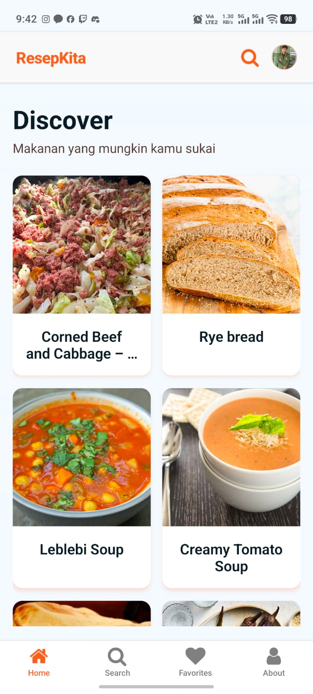
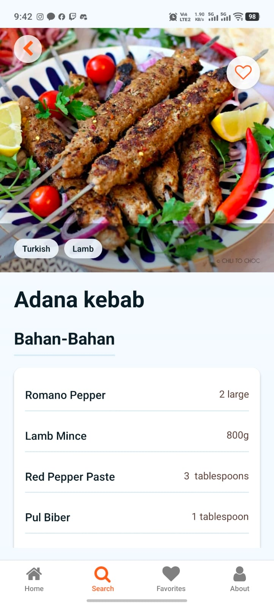
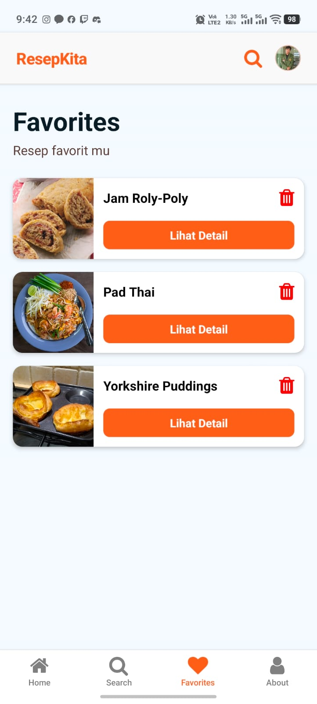
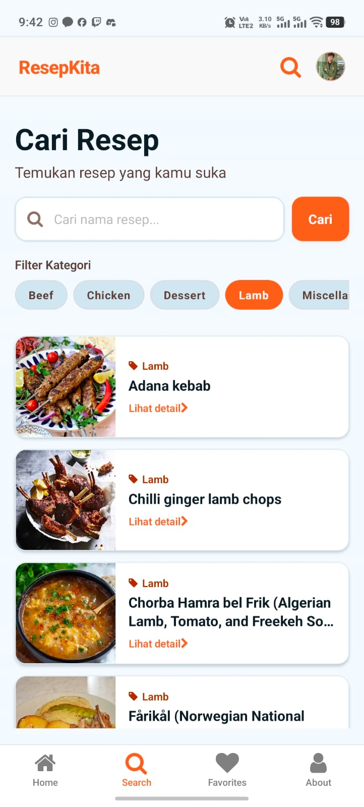
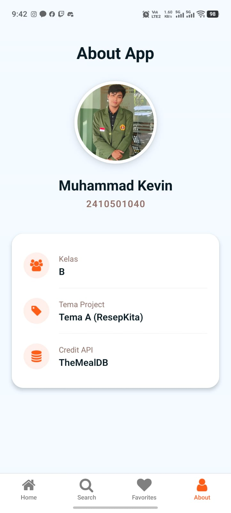

# ResepKita

## Informasi Mahasiswa

- **Nama** : Muhammad Kevin
- **NIM** : 2410501040
- **Kelas** : B

## Tema Yang Dipilih

Tema A: ResepKita (API: themealdb.com)

## Tech Stack + Versi

- **React Native 0.81.5**: Framework untuk membangun aplikasi mobile.
- **Axios 1.15.2**: Library untuk melakukan permintaan HTTP.
- **Zustand 5.0.12**: Library untuk mengelola state.
- **React Navigation 7.15.9**: Library untuk navigasi antar screen.
- **AsyncStorage 2.2.0**: Library untuk menyimpan data secara lokal.
- **Expo 54.0.33**: Platform untuk membangun aplikasi mobile.

## Cara install & run

git clone https://github.com/ryuvyyn/uts-mobile-lanjut-2410501040-Muhammad_Kevin.git
cd uts-mobile-lanjut-2410501040-Muhammad_Kevin
npm install
npx expo start

## Screenshot

### 1. Home Screen

### 2. Detail Screen

### 3. Favorite Screen

### 4. Search Screen

### 5. About Screen

## Link Video Demo

- https://drive.google.com/file/d/14NMcV9BfjAjMJWvH0EZSVSsMPjwqikXi/view

## Penjelasan State Management Yang Dipilih + Justifikasi

Zustand dipilih sebagai state management pada proyek ini dikarenakan kesederhanaan dan performa tingginya. Berbeda dengan
Redux yang memerlukan banyak kode boilerplate serta penggunaan Provider yang membungkus seluruh aplikasi, Zustand memungkinkan 
implementasi yang jauh lebih ringkas. Selain itu, sifatnya yang anti re-render berlebihan juga sangat cocok untuk aplikasi 
mobile, memastikan bahwa hanya komponen yang terkait yang diperbarui saat terjadi perubahan data, sehingga menjaga aplikasi 
tetap responsif dan hemat daya. Selain itu middleware seperti persist mudah untuk diintegrasikan dengan AsyncStorage yang 
digunakan pada aplikasi ini untuk menyimpan data secara lokal. Kesederhanaan integrasinya menjadikan Zustand pilihan yang 
tepat untuk aplikasi ini.

## Daftar Referensi

- https://youtu.be/cdnneQjsoT0
- https://www.youtube.com/watch?v=iPVaAy2LzPY

- https://reactnative.dev/docs/refreshcontrol

- https://reactnavigation.org/docs/stack-navigator/
- https://reactnavigation.org/docs/bottom-tab-navigator/
- https://reactnavigation.org/docs/nesting-navigators/

- https://docs.expo.dev/versions/latest/sdk/async-storage/
- https://react-native-async-storage.github.io/2.0/Usage/

- https://reactnative.dev/docs/components-and-apis#basic-components
- https://zustand.docs.pmnd.rs/reference/apis/create
- https://zustand.docs.pmnd.rs/reference/apis/create-store
- https://zustand.docs.pmnd.rs/reference/hooks/use-store
- https://zustand.docs.pmnd.rs/reference/middlewares/persist

- https://axios.rest/pages/getting-started/examples/commonjs.html
- https://axios.rest/pages/advanced/create-an-instance.html
- https://axios.rest/pages/advanced/response-schema.html

- https://gist.github.com/burakorkmez/11bc1e5939bcc8d0a4b2f6bf1c2c6a3d

## Refleksi Pengerjaan

Selama proses pengerjaan proyek aplikasi ResepKita, terdapat beberapa kendala yang cukup menantang. Salah satu
kesulitan adalah merancang komponen category chip. Tantangan utamanya tidak hanya pada pengaturan layout antarmuka, tetapi
juga pada pengelolaan state untuk menandai kategori mana yang sedang aktif, serta bagaimana menghubungkan perubahan state 
tersebut dengan proses filtering data dari API. Selain itu, implementasi fitur pull-to-refresh pada list resep lumayan 
menantang karena harus memastikan sinkronisasi yang tepat antara state refreshing komponen RefreshControl dengan state 
loading bawaan aplikasi agar refresh data dari API tidak memunculkan bug. Tantangan lainnya adalah saat mengonfigurasi 
Zustand menggunakan middleware persist bersama AsyncStorage. Butuh penyesuaian ekstra untuk memahami alurnya agar data 
favorit resep dapat tersimpan secara lokal dan tetap persisten meskipun aplikasi telah ditutup dan dibuka kembali.

Dalam fase pengembangan, beberapa bug juga sempat menghambat proses pengerjaan. Salah satu error adalah crash dengan pesan 
"Module not found". Hal ini terjadi setelah saya melakukan refactor struktur proyek, yaitu mengubah nama folder utils menjadi 
hooks. Ternyata, environment tidak memperbarui jalur import pada beberapa komponen secara otomatis, sehingga saya harus 
melacak dan memperbaiki path import tersebut secara manual.

Terlepas dari berbagai kendala dan bug yang muncul, pengerjaan UTS ini memberikan banyak pemahaman baru yang berguna.
Saya berhasil memahami dan mempraktikkan penggunaan Zustand, yang terbukti menjadi alternatif state management yang jauh lebih 
ringkas dan bebas dari boilerplate rumit jika dibandingkan dengan Redux. Pemahaman saya terkait persistensi data di React 
Native juga meningkat berkat kombinasi Zustand dan AsyncStorage, yang secara signifikan meningkatkan pengalaman pengguna 
karena data tidak hilang saat restart. Terakhir, pemahaman saya terhadap data fetching menggunakan Axios menjadi jauh lebih 
baik. Saya belajar banyak tentang cara membuat instance Axios untuk efisiensi base URL, menangani asynchronous request 
(termasuk memanfaatkan Promise.all), hingga menyaring dan menstrukturkan response JSON yang kompleks dari TheMealDB ke dalam 
aplikasi.